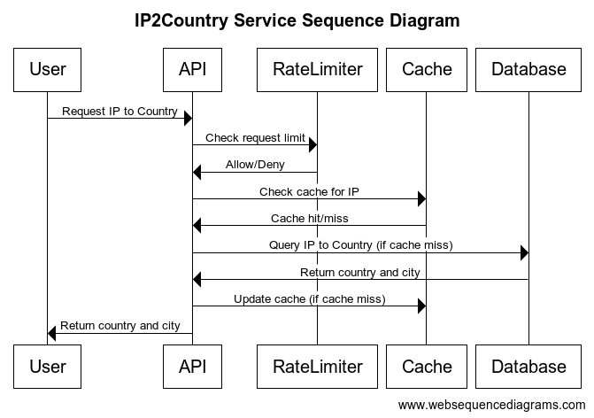

# IP2Country

IP2Country is a Go-based application that provides an API to determine the country and city based on an IP address. The project includes a rate limiter, caching, and integration with disk-based and MongoDB repositories.

## Features

- **HTTP Server**: Provides an API to get country and city information based on IP.
- **Rate Limiter**: Limits the number of requests (globally and per client IP) to prevent abuse (Using Token bucket algorithm).
    - **Local mode**: Keeps an internal mapping of client IPs and their request counts.
    - **Distributed mode**: Uses Redis to store client IPs and their request counts.
- **Caching**: Caches responses to improve performance.
- **Repositories**:
    - **Disk Repository**: Stores IP to country/city mappings on disk.
    - **MongoDB Repository**: Stores IP to country/city mappings in a MongoDB database.
- **Testing**: Includes unit and integration tests.

## Sequence Diagram



## Requirements

- Go 1.22+
- Docker (for building and running the application in a container)
- Make (for running build and test commands)
- Kind (for running the application in a local Kubernetes cluster)

## Installation

1. Clone the repository:
    ```sh
    git clone https://github.com/ransoor2/ip2country.git
    cd ip2country
    ```

2. Install dependencies:
    ```sh
    go mod tidy
    go mod download
    ```

3. Install `swag` for generating Swagger documentation:
    ```sh
    make install
    ```

## Configuration

Configuration is managed via a YAML file and environment variables. The default configuration file is located at `config/config.yml`.

### Configuration Options

- **App**:
    - `Name`: The name of the application.
    - `Version`: The version of the application.
- **HTTP**:
    - `Port`: The port on which the HTTP server will run.
- **Log**:
    - `Level`: The logging level (e.g., debug, info, warn, error).
- **Cache**:
    - `Size`: The size of the cache.
- **Repository**:
    - `Type`: The type of repository to use (disk/mongo).
- **DiskRepository**:
    - `RelativePath`: The relative path to the disk-based repository file.
- **MongoRepository**:
    - `URI`: The URI for connecting to the MongoDB database.
    - `DB`: The name of the MongoDB database.
    - `Collection`: The name of the MongoDB collection.
- **RateLimiter**:
    - `Type`: The type of rate limiter to use (local/distributed).
    - `MaxRequests`: The maximum number of requests allowed.
    - `UserRequests`: The number of allowed requests per IP.
    - `Interval`: The interval for rate limiting (buckets refill).
    - `BucketTTL`: The time-to-live for rate limiter buckets.
    - `CleanInterval`: The interval for cleaning up expired rate limiter buckets.
    - `RedisAddr`: The address of the Redis server (required for distributed rate limiter).

## Running the Application

To run the application locally:

1. Generate Swagger documentation:
    ```sh
    make swag-v1
    ```

2. Run the application:
    ```sh
    make run
    ```

## Testing

To run the tests:

```sh
make test
```

## Running with Docker

To build a Docker image:

```sh
make docker-build
```

Once the docker is running you can access the API at `http://localhost:8080/swagger/index.html#`.

Curl command to get country and city by IP:
```sh
curl "http://localhost:8080/v1/find-country?ip=8.8.8.8"
```

To run a distributed rate limiter with Redis change the `RateLimiter.Type` to `distributed` and provide the `RateLimiter.RedisAddr` in the `config/config.yml` file.
```sh
docker run -d --name redis-stack -p 6379:6379 -p 8001:8001 redis/redis-stack:latest
```

## Running in Kubernetes

To create a Kubernetes cluster and install the application:

```sh
make kind-install
```

Once the application is running in the Kubernetes cluster:
```sh
curl "http://localhost:30000/v1/find-country?ip=3.3.3.3"
```

To delete the Kubernetes cluster:

```sh
make kind-delete
```

**Note**: Configuration and database data can be provided via the `configmap.yaml` file.

## API Endpoints

- **GET /v1/find-country**: Get country and city by IP.
    - **Query Parameters**:
        - `ip`: The IP address to lookup.
    - **Responses**:
        - `200 OK`: Returns the country and city.
        - `400 Bad Request`: Invalid IP address.
        - `404 Not Found`: IP address not found.
        - `429 Too Many Requests`: Rate limit exceeded.

- **GET /healthz**: Health check endpoint.
- **GET /metrics**: Prometheus metrics endpoint.

## Development

### Database

To support another kind of database, the following interface needs to be implemented:

```go
type Repository interface {
 CountryNCityByIP(context.Context, string) (string, string, error)
}
```

### Rate Limiting

To support another kind of rate limiting, the following interface needs to be implemented:

```go
type RateLimiter interface {
 Allow(ctx context.Context, clientIP string) bool
}
```

### Things to Improve

- **Observability**:
    - Add more logs, metrics and traces.

- **Integration Tests**:
    - Create integration tests for Redis.
    - Create integration tests for MongoDB. 

- **HTTP Server**:
    - Modify the HTTP server to support an in-memory listener for testing purposes. This will allow for more efficient and isolated tests without the need for network dependencies.

- **Versioning**:
    - Add versioning to CICD.